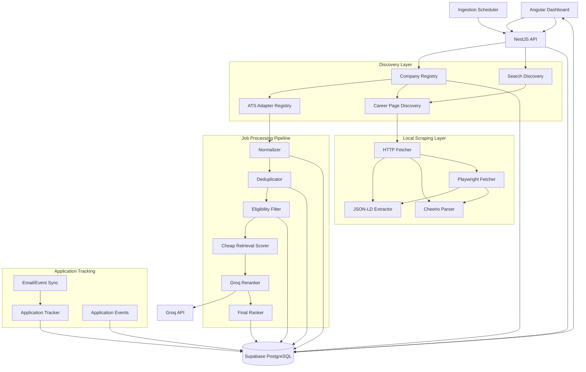
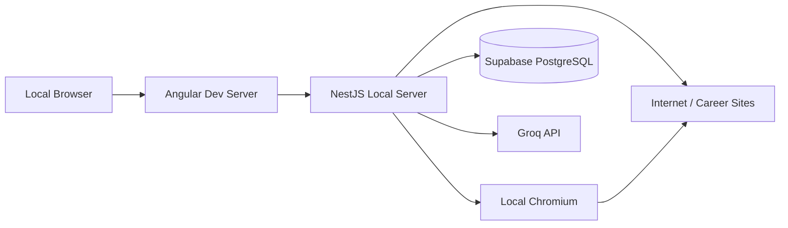
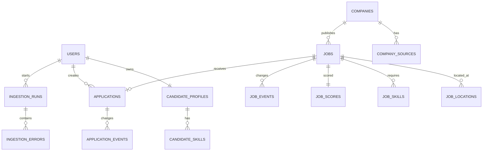
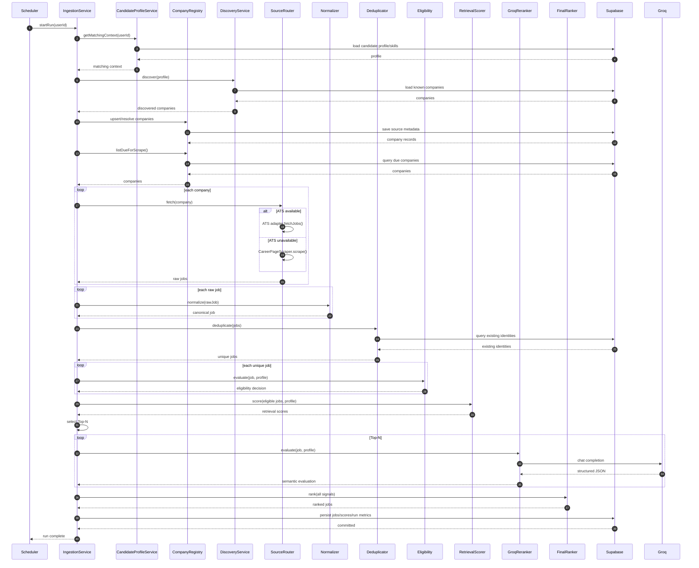
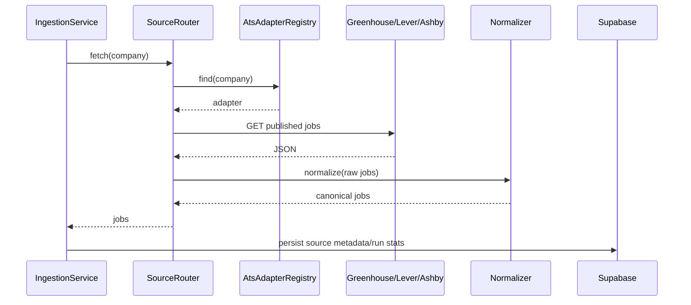
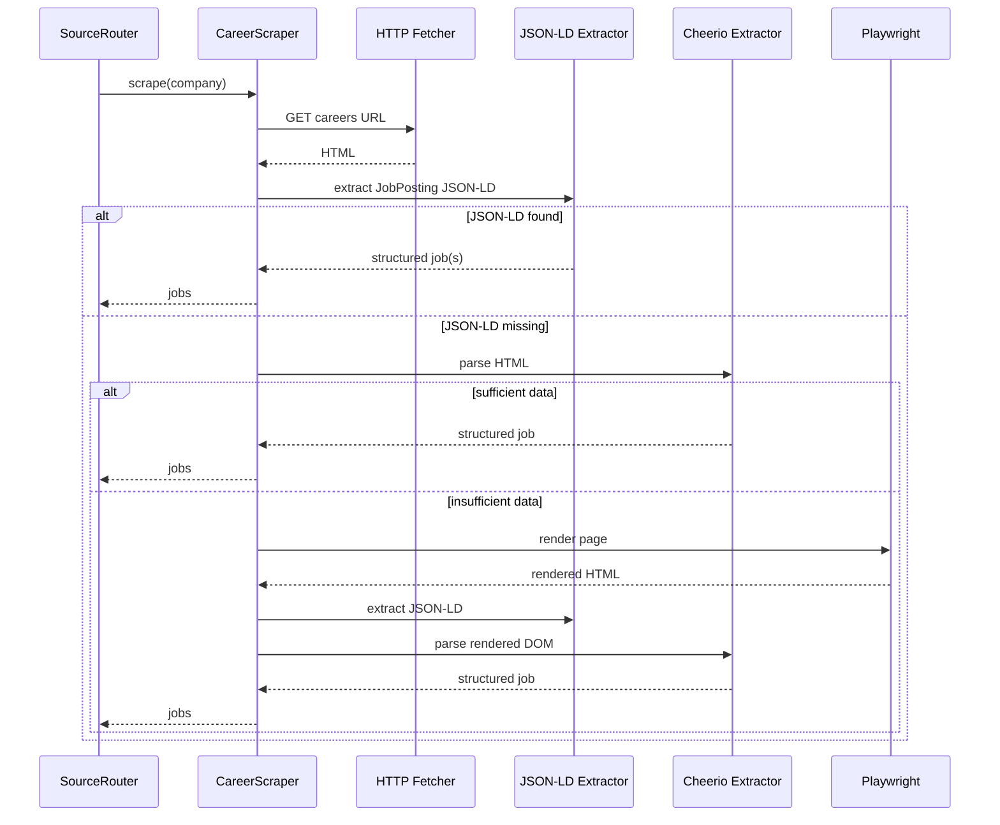
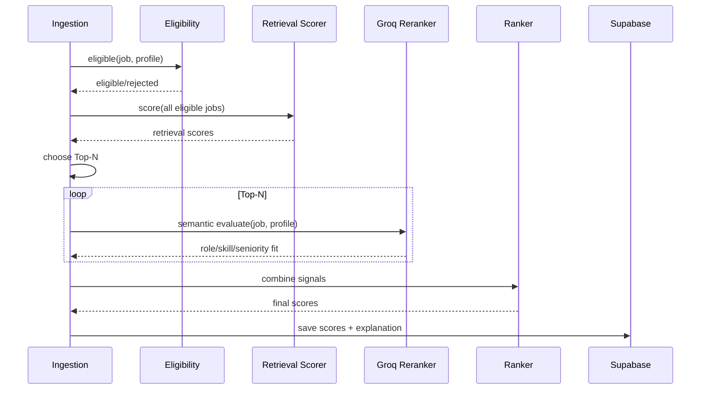
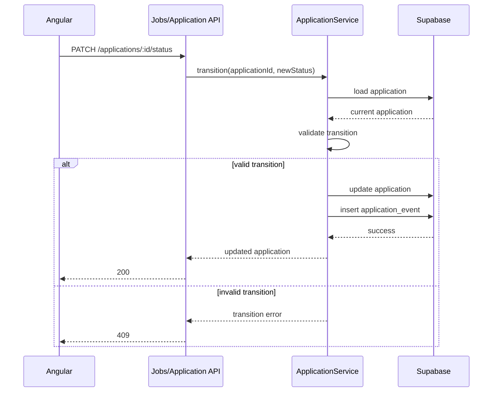
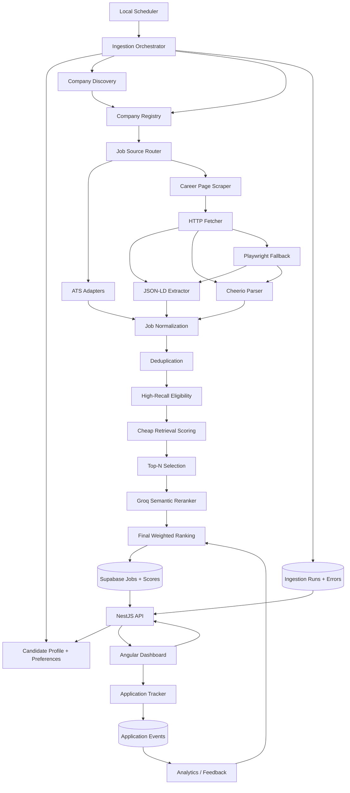

# Job Search Automation System
## Detailed HLD + LLD + Implementation Specification

**Version:** 1.0  
**Target runtime:** Local development/runtime  
**Database:** Supabase PostgreSQL  
**Backend:** NestJS + TypeScript  
**Frontend:** Angular  
**LLM:** Groq-compatible API  
**Scraping:** Native HTTP + Cheerio + Playwright  
**Firecrawl:** Removed from the critical path  
**Primary goal:** Find fresh, high-fit software-engineering jobs, rank them intelligently, and track the full application lifecycle with minimal manual work.

---

# 0. Executive Decision

The existing application is **not a throw-away project**. The current audit shows a solid base around NestJS, Supabase/Postgres, company discovery, ATS adapters, job persistence, deduplication, Groq analysis, and dashboard tracking.

The redesign should therefore **retain the application shell and database foundation** while replacing the core discovery/retrieval/ranking flow.

The target system is:

```text
Candidate Profile
       |
       v
Search Strategy -----------------------------------------------+
       |                                                       |
       +--------------------+----------------------+           |
       |                    |                      |           |
       v                    v                      v           |
 Direct ATS            Career Pages          Search/Web       |
 Greenhouse            HTTP + Cheerio         Discovery       |
 Lever                 Playwright fallback        |           |
 Ashby                         |                  |           |
 Others                        +------------------+           |
                                      |                       |
                                      v                       |
                              Raw Job Candidates              |
                                      |                       |
                                      v                       |
                               Normalization                   |
                                      |                       |
                                      v                       |
                                 Deduplication                 |
                                      |                       |
                                      v                       |
                           Hard Eligibility Filter             |
                                      |                       |
                                      v                       |
                             Retrieval / Scoring                |
                                      |                       |
                                      v                       |
                               Top-N Selection                  |
                                      |                       |
                                      v                       |
                                Groq Reranker                  |
                                      |                       |
                                      v                       |
                           Final Personalized Rank              |
                                      |                       |
                                      v                       |
                           Dashboard / Shortlist               |
                                      |                       |
                                      v                       |
                           Application Tracking                |
                                      |                       |
                                      v                       |
                             Feedback / Analytics               |
                                      |                       |
                                      +-----------------------+
```

The key design principle is:

> **Use deterministic code to retrieve and eliminate obvious failures; use the LLM only for semantic judgment and reranking.**

---

# 1. Source Audit Baseline

The existing implementation audit describes the current system as a twice-daily ingestion pipeline that discovers companies, resolves career pages, fetches jobs through ATS APIs or Firecrawl, applies keyword/location filters, deduplicates, runs one Groq analysis per job, stores the results, and exposes them through an Angular dashboard. The critical current limitation is that the Groq score is not the default ranking/filtering signal: jobs are shown by scrape time unless the user manually changes sorting/filtering. [Source: current codebase audit]

The audit also identifies several important constraints in the current system:

- company discovery relies on a small static query set;
- new-company discovery is capped per run;
- direct ATS adapters already exist for Greenhouse, Lever, and Ashby;
- custom career pages currently depend on Firecrawl mapping/scraping;
- role/location filtering is largely hardcoded;
- the current Groq output is a single holistic score plus skill-gap data;
- up to 100 jobs can be inserted while only up to 40 are analyzed per run;
- company scraping is not freshness-aware and can grow without bound;
- application tracking has basic statuses and status history but lacks OA/shortlist/follow-up/interview scheduling/contact concepts.

The target design in this document directly addresses those limitations while preserving useful existing components.

---

# 2. Goals

## 2.1 Primary Goals

1. Find more relevant jobs without relying on paid crawling infrastructure.
2. Minimize false negatives during discovery and pre-filtering.
3. Prefer fresh jobs and surface jobs worth applying to first.
4. Support structured ATS APIs whenever available.
5. Scrape ordinary/static career pages locally using HTTP + Cheerio.
6. Use Playwright only for JavaScript-rendered pages or difficult pages.
7. Normalize all sources into one internal job model.
8. Deduplicate jobs reliably.
9. Separate eligibility, retrieval, scoring, and semantic reranking.
10. Make ranking explainable.
11. Track application lifecycle from discovery through interview/offer.
12. Keep the system runnable entirely locally except for Supabase Postgres and external APIs.
13. Preserve the ability to add more ATS adapters later.
14. Produce measurable metrics so the system can be improved using real feedback.

## 2.2 Non-Goals for V1

1. Automatic application submission to third-party websites.
2. Aggressive crawling of the open internet.
3. Multi-user SaaS architecture.
4. Microservices.
5. Distributed queues.
6. LLM fine-tuning.
7. Full autonomous browser agents.
8. Paid scraping APIs.
9. Building a generalized web crawler comparable to commercial crawling platforms.

The system is a personal job-search tool, so simplicity wins.

---

# 3. Non-Functional Requirements

## 3.1 Cost

The application should have no mandatory paid infrastructure other than whatever external API usage the user elects to keep.

Required external services:

```text
Supabase PostgreSQL
Groq API
```

Optional:

```text
Email provider / Gmail connector
External search provider
```

No Firecrawl requirement.

## 3.2 Performance

For an ingestion run:

- ATS requests should be concurrent but rate-limited.
- Static HTTP fetches should be concurrent with a small bounded concurrency.
- Playwright should run with a strict concurrency cap because browsers are memory-heavy.
- LLM analysis should be performed only on a filtered Top-N candidate set.

Suggested initial limits:

```text
ATS concurrency:            5
HTTP scraper concurrency:   5
Playwright concurrency:     2
LLM concurrency:             1
Max new companies/run:      20
Max candidate jobs/run:     300
Max LLM jobs/run:            50
```

These are starting values, not permanent constants.

## 3.3 Reliability

A single broken career page must never abort the entire ingestion run.

Expected behavior:

```text
company A fails
     |
     +--> record failure
     +--> continue company B
```

## 3.4 Idempotency

Running ingestion twice against the same source should not create duplicate job records.

## 3.5 Explainability

Every ranked job must be explainable using structured signals:

- role fit
- seniority fit
- experience fit
- required-skill fit
- preferred-skill fit
- location fit
- freshness
- source reliability
- user/company preference
- critical gaps

---

# 4. Target High-Level Architecture



---

# 5. Deployment Topology

Everything except Supabase and external LLM/API calls runs locally.



## Suggested local process

```text
Terminal 1: Angular
npm run start:web

Terminal 2: NestJS
npm run start:api

Browser:
http://localhost:4200

Supabase:
remote managed PostgreSQL

Playwright:
launched locally by NestJS worker/service
```

No local Redis is required for V1.

No Docker requirement is required for V1.

---

# 6. Module Catalogue

| Module | Purpose | Priority |
|---|---|---:|
| CandidateProfileModule | Candidate skills, roles, preferences | P0 |
| CompanyRegistryModule | Companies and source configuration | P0 |
| DiscoveryModule | Find new companies/career sources | P0 |
| ATSModule | Structured job fetching from ATS APIs | P0 |
| CareerPageModule | Discover/fetch jobs from career pages | P0 |
| ScraperModule | HTTP/Cheerio/Playwright infrastructure | P0 |
| JobNormalizationModule | Convert raw candidates to canonical jobs | P0 |
| DeduplicationModule | Prevent duplicate jobs | P0 |
| EligibilityModule | Cheap high-recall filtering | P0 |
| RetrievalScoringModule | Cheap candidate scoring | P0 |
| LlmRerankingModule | Semantic ranking | P0 |
| RankingModule | Final weighted ranking | P0 |
| IngestionModule | Orchestrate end-to-end runs | P0 |
| SchedulingModule | Scheduled execution | P0 |
| ApplicationModule | Application lifecycle | P1 |
| EmailSyncModule | Detect application/interview emails | P1 |
| AnalyticsModule | Feedback and funnel analytics | P1 |
| ObservabilityModule | Logs, run metrics, errors | P0 |
| NotificationModule | Daily digest/reminders | P1 |

---

# 7. CandidateProfileModule

## 7.1 Responsibility

Provide a structured, editable representation of the candidate.

It is the source of truth for matching behavior.

The profile must not depend on compile-time constants.

## 7.2 Data Model

```ts
interface CandidateProfile {
  id: string;
  userId: string;
  currentTitle: string | null;
  experienceYears: number;
  targetRoles: TargetRole[];
  preferredLocations: LocationPreference[];
  seniority: SeniorityPreference;
  workModes: WorkMode[];
  employmentTypes: EmploymentType[];
  salaryPreference: SalaryPreference | null;
  requiredSkills: CandidateSkill[];
  preferredSkills: CandidateSkill[];
  excludedRoles: string[];
  excludedCompanies: string[];
  domainPreferences: string[];
  domainExclusions: string[];
  rawCvText: string;
}
```

## 7.3 LLD

```ts
interface CandidateProfileRepository {
  getByUserId(userId: string): Promise<CandidateProfile | null>;
  upsert(profile: CandidateProfile): Promise<CandidateProfile>;
}

interface CandidateProfileService {
  get(userId: string): Promise<CandidateProfile>;
  update(userId: string, patch: CandidateProfilePatch): Promise<CandidateProfile>;
  buildMatchingContext(userId: string): Promise<MatchingContext>;
}
```

`buildMatchingContext()` should cache/prepare the structured context once per ingestion run rather than reconstructing it for every job.

## 7.4 Acceptance Criteria

- User can change target roles without changing code.
- User can change location without redeploying.
- User can set preferred and excluded skills.
- User can set seniority range.
- LLM prompts consume structured profile data.

---

# 8. CompanyRegistryModule

## 8.1 Responsibility

Maintain the set of companies the system knows about and how each company should be scraped.

## 8.2 Entity

```ts
interface Company {
  id: string;
  userId: string;
  name: string;
  normalizedName: string;
  domain: string | null;
  careersUrl: string | null;
  source: 'seed' | 'discovered' | 'manual';
  atsType: AtsType | null;
  atsToken: string | null;
  active: boolean;
  priority: number;
  resolutionStatus: 'pending' | 'resolved' | 'failed';
  lastResolvedAt: Date | null;
  lastScrapedAt: Date | null;
  nextScrapeAt: Date | null;
  failureCount: number;
}
```

## 8.3 Core Rules

1. Every company has a normalized identity.
2. Every resolved company has a source strategy.
3. Companies are not scraped unconditionally every run.
4. `nextScrapeAt` determines eligibility for another scrape.
5. Failed companies are retried using backoff.

## 8.4 Service Interface

```ts
interface CompanyRegistryService {
  upsert(company: DiscoveredCompany): Promise<Company>;
  resolveSource(companyId: string): Promise<CompanyResolutionResult>;
  listDueForScrape(limit: number): Promise<Company[]>;
  markScraped(companyId: string, stats: ScrapeStats): Promise<void>;
  markFailed(companyId: string, error: NormalizedError): Promise<void>;
}
```

---

# 9. DiscoveryModule

## 9.1 Responsibility

Find companies/career sources, not job postings directly.

Discovery should have two inputs:

```text
1. curated seed companies
2. broad company discovery
```

## 9.2 Discovery Strategy

Generate search intents from the candidate profile.

Example search combinations:

```text
"backend engineer" "typescript" India
"node.js engineer" India startup
"nestjs" "backend engineer" India
"software engineer" "typescript" remote
"node.js" "postgresql" India jobs
```

Do not use only one hardcoded seven-query list.

## 9.3 LLD

```ts
interface DiscoveryQueryBuilder {
  buildQueries(profile: CandidateProfile): DiscoveryQuery[];
}

interface CompanyDiscoveryProvider {
  search(query: DiscoveryQuery): Promise<CompanyDiscoveryHit[]>;
}

interface CompanyDiscoveryService {
  discover(profile: CandidateProfile): Promise<DiscoveredCompany[]>;
}
```

## 9.4 High-Recall Principle

Discovery is allowed to produce false positives.

It should not decide final job relevance.

Correct:

```text
possible backend company -> keep
```

Incorrect:

```text
title doesn't contain "backend" -> discard company
```

---

# 10. ATSModule

## 10.1 Responsibility

Fetch structured jobs from ATS platforms without browser scraping.

## 10.2 Adapter Interface

```ts
interface AtsAdapter {
  type: AtsType;
  canHandle(company: Company): boolean;
  fetchJobs(company: Company): Promise<RawJobCandidate[]>;
  fetchJob?(company: Company, externalId: string): Promise<RawJobCandidate | null>;
}
```

## 10.3 Adapter Registry

```ts
class AtsAdapterRegistry {
  constructor(
    private readonly adapters: AtsAdapter[],
  ) {}

  find(company: Company): AtsAdapter | null {
    return _.find(this.adapters, adapter => adapter.canHandle(company)) ?? null;
  }
}
```

## 10.4 Initial Adapters

```text
Greenhouse
Lever
Ashby
```

Later:

```text
SmartRecruiters
Workable
Workday
Jobvite
Custom JSON APIs
```

## 10.5 ATS Failure Policy

If an ATS endpoint fails:

```text
ATS request
   |
   +--> success -> normalize
   |
   +--> 404/invalid board -> mark resolution invalid
   |
   +--> 429/5xx -> retry with backoff
   |
   +--> repeated failure -> fallback to careers URL if available
```

---

# 11. CareerPageModule

## 11.1 Responsibility

Resolve a company's careers URL and identify likely job posting links.

It should not parse every website in an attempt to create a universal crawler.

## 11.2 LLD

```ts
interface CareerPageResolver {
  resolve(company: Company): Promise<CareerPageResolution>;
}

interface JobLinkDiscoverer {
  discover(page: FetchedPage): Promise<JobLink[]>;
}
```

## 11.3 Resolution Order

```text
known ATS
   ↓
known careers URL
   ↓
company website /robots / sitemap
   ↓
search discovery
```

---

# 12. ScraperModule

This is the replacement for Firecrawl.

## 12.1 Design

Use a tiered fetcher.

```text
Tier 1: native HTTP
Tier 2: JSON-LD extraction
Tier 3: Cheerio extraction
Tier 4: Playwright
```

## 12.2 Fetcher Interface

```ts
interface PageFetcher {
  fetch(url: string, options?: FetchOptions): Promise<FetchedPage>;
}
```

Implementations:

```ts
class HttpPageFetcher implements PageFetcher {}
class PlaywrightPageFetcher implements PageFetcher {}
```

## 12.3 HTTP Fetcher

Responsibilities:

- request HTML
- set realistic headers
- enforce timeout
- follow redirects
- reject oversized responses
- retry selected transient errors
- capture status and content type

Pseudo-code:

```ts
async fetch(url: string): Promise<FetchedPage> {
  const response = await retry(
    () => fetchWithTimeout(url),
    retryPolicy,
  );

  return {
    url: response.url,
    status: response.status,
    contentType: response.headers.get('content-type'),
    html: await response.text(),
  };
}
```

## 12.4 JSON-LD Extractor

Search for:

```html
<script type="application/ld+json">...</script>
```

Prefer objects where:

```json
"@type": "JobPosting"
```

Fields to extract:

```text
title
description
datePosted
validThrough
employmentType
hiringOrganization
jobLocation
applicantLocationRequirements
baseSalary
url
identifier
```

## 12.5 Cheerio Extractor

Use generic selectors first:

```text
h1
main
article
[role="main"]
[data-job]
[data-testid*="job"]
```

Then site-specific adapters where necessary.

## 12.6 Playwright Fallback

Use Playwright only if:

- HTTP page is a JS shell;
- job list appears only after JS execution;
- known job content is missing from server HTML;
- an interaction is required to reveal jobs.

Do not launch a browser for every URL.

## 12.7 Browser Safety / Resource Limits

```text
max browser concurrency = 2
page timeout = 20–30 sec
max page size = configured limit
close page immediately after extraction
reuse browser process when possible
```

---

# 13. JobNormalizationModule

## 13.1 Responsibility

Convert every source into one canonical structure.

## 13.2 Canonical Raw Job

```ts
interface RawJobCandidate {
  sourceType: JobSourceType;
  externalId: string | null;
  companyId: string;
  companyName: string;
  title: string;
  url: string;
  locationRaw: string | null;
  descriptionRaw: string | null;
  snippet: string | null;
  postedAt: Date | null;
  employmentType: string | null;
  remote: boolean | null;
  metadata: Record<string, unknown>;
}
```

## 13.3 Canonical Job

```ts
interface CanonicalJob {
  sourceIdentity: SourceIdentity;
  companyId: string;
  title: string;
  normalizedTitle: string;
  canonicalUrl: string;
  description: string;
  locations: JobLocation[];
  remoteMode: RemoteMode;
  employmentType: EmploymentType | null;
  postedAt: Date | null;
  discoveredAt: Date;
  sourceReliability: number;
  extractionConfidence: number;
}
```

## 13.4 Normalization Steps

```text
raw source
 ↓
normalize URL
 ↓
normalize title
 ↓
clean whitespace
 ↓
normalize location
 ↓
normalize employment type
 ↓
normalize date
 ↓
strip duplicated boilerplate
 ↓
CanonicalJob
```

Use lodash heavily for string/collection normalization where it improves readability.

---

# 14. DeduplicationModule

## 14.1 Identity Hierarchy

Use the strongest available identity first:

```text
1. source + externalJobId
2. canonical application URL
3. company + normalized title + normalized location
4. content fingerprint as a fallback
```

Do not use only:

```text
company + title
```

because large companies can have identical titles in different locations.

## 14.2 URL Canonicalization

Strip tracking parameters such as:

```text
utm_*
gclid
fbclid
ref
tracking IDs
```

Normalize:

```text
protocol
hostname
www
trailing slash
query ordering
```

## 14.3 Content Fingerprint

Compute a normalized description fingerprint:

```text
lowercase
remove whitespace noise
remove boilerplate
hash
```

Use this only as a fallback because identical descriptions can appear in multiple legitimate requisitions.

---

# 15. EligibilityModule

## 15.1 Critical Principle

Eligibility is a **high-recall gate**.

Do not use strict keyword logic for nuanced engineering titles.

## 15.2 Hard Rejections

Examples:

```text
Clearly non-engineering department
Invalid/closed posting
Clearly incompatible geography when location is mandatory
Internship when user explicitly excludes internships
Management role when user explicitly excludes management
Experience range impossible
```

## 15.3 Soft Signals

Do not hard reject purely because the title is:

```text
Platform Engineer
Infrastructure Engineer
Developer Productivity Engineer
Solutions Engineer
Software Engineer II
Systems Engineer
```

Send borderline engineering roles downstream.

## 15.4 LLD

```ts
interface EligibilityDecision {
  eligible: boolean;
  reasonCodes: string[];
  hardSignals: EligibilitySignal[];
  softSignals: EligibilitySignal[];
}

interface EligibilityService {
  evaluate(job: CanonicalJob, profile: CandidateProfile): EligibilityDecision;
}
```

---

# 16. RetrievalScoringModule

## 16.1 Purpose

Perform cheap scoring before an LLM call.

This controls LLM cost.

## 16.2 Signals

Suggested initial scoring:

```text
Role similarity                 25
Required skill lexical overlap  25
Experience compatibility        20
Location/work mode              10
Preferred skill overlap         10
Freshness                        5
Source reliability               5
-----------------------------------
Total                           100
```

This is not the final semantic score.

## 16.3 Retrieval Output

```ts
interface RetrievalScore {
  score: number;
  roleSignal: number;
  skillSignal: number;
  experienceSignal: number;
  locationSignal: number;
  preferenceSignal: number;
  freshnessSignal: number;
  sourceSignal: number;
}
```

## 16.4 Top-N Rule

Example:

```text
discover 300 jobs
 ↓
250 survive eligibility
 ↓
calculate cheap score
 ↓
sort descending
 ↓
Top 50 → Groq
```

This is superior to analyzing the first 40 inserted records.

---

# 17. LlmRerankingModule

## 17.1 Purpose

Use Groq only for semantic judgment of the best candidates.

## 17.2 Input

The LLM should receive:

```text
candidate structured profile
candidate CV evidence
job structured summary
required skills
preferred skills
retrieval score
```

Avoid sending huge duplicated raw documents unnecessarily.

## 17.3 Output

```ts
interface LlmJobEvaluation {
  roleFit: number;
  seniorityFit: number;
  requiredSkillFit: number;
  preferredSkillFit: number;
  experienceFit: number;
  domainFit: number;
  criticalMismatch: boolean;
  matchedSkills: string[];
  missingSkills: string[];
  criticalGaps: string[];
  summary: string;
  confidence: number;
}
```

## 17.4 Prompt Rules

The prompt must explicitly define score semantics.

Example:

```text
0-20   clearly unsuitable
21-40  weak fit
41-60  possible but significant gaps
61-75  decent fit
76-89  strong fit
90-100 exceptional fit
```

The LLM must never invent skills or experience.

## 17.5 Validation

Validate:

- required numeric fields
- numeric ranges 0–100
- enum values
- arrays
- string lengths
- missing fields

Reject malformed output and retry once with a repair prompt only if necessary.

---

# 18. RankingModule

## 18.1 Purpose

Combine deterministic signals and semantic LLM signals into a stable final score.

## 18.2 Suggested Formula

```text
final_score =
    retrieval_score * 0.35
  + llm_score       * 0.45
  + freshness       * 0.10
  + preference      * 0.10
```

The actual weights should live in configuration/database rather than code.

## 18.3 Hard Gate

Even a high semantic score cannot bypass a hard eligibility rejection.

## 18.4 Recommendation Bands

```text
90–100  APPLY_NOW
80–89   STRONG_MATCH
70–79   CONSIDER
60–69   LOW_PRIORITY
<60     SKIP
```

These values are starting points and should be tuned from application outcomes.

## 18.5 Explanation

Every result should include:

```text
Why it ranks highly
Strong overlaps
Missing critical skills
Potential concerns
```

---

# 19. IngestionModule

## 19.1 Responsibility

Coordinate the whole pipeline.

## 19.2 Pipeline

```text
create run
 ↓
load candidate profile
 ↓
select companies due for scrape
 ↓
discover new companies
 ↓
resolve companies
 ↓
fetch jobs from sources
 ↓
normalize
 ↓
deduplicate
 ↓
eligibility
 ↓
cheap retrieval score
 ↓
select Top-N
 ↓
Groq reranking
 ↓
final ranking
 ↓
persist
 ↓
update metrics
 ↓
finish run
```

## 19.3 Service Interface

```ts
interface IngestionService {
  run(userId: string, options?: IngestionOptions): Promise<IngestionRunResult>;
}
```

## 19.4 Run Tracking

Create an `ingestion_runs` row immediately.

Track counters:

```text
discoveredCompanies
resolvedCompanies
failedCompanies
rawJobs
normalizedJobs
duplicates
eligibleJobs
retrievalCandidates
llmAnalyzed
highFitJobs
errors
```

---

# 20. SchedulingModule

## 20.1 V1

Use NestJS scheduler / cron in the same local process.

Suggested schedule:

```text
06:00 India time
18:00 India time
```

## 20.2 Company Scheduling

Do not scrape every company every run.

Calculate:

```text
next_scrape_at
```

based on:

```text
priority
last_scraped_at
failure_count
company activity
```

Example:

```text
Priority 10 → every 6h
Priority 7  → every 12h
Priority 4  → every 24h
```

## 20.3 Backoff

For repeated failure:

```text
1st failure → retry after 1h
2nd         → 4h
3rd         → 12h
4th         → 24h
5th+        → manual review
```

---

# 21. ApplicationModule

## 21.1 Goal

Turn job discovery into an application workflow.

## 21.2 Recommended Status Model

```text
DISCOVERED
SHORTLISTED
APPLYING
APPLIED
OA
PHONE_SCREEN
TECHNICAL
HM
FINAL
OFFER
REJECTED
WITHDRAWN
GHOSTED
CLOSED
```

## 21.3 Transition Validation

```ts
const ALLOWED_TRANSITIONS: Record<ApplicationStatus, ApplicationStatus[]> = {
  DISCOVERED: ['SHORTLISTED', 'REJECTED', 'CLOSED'],
  SHORTLISTED: ['APPLYING', 'REJECTED', 'CLOSED'],
  APPLYING: ['APPLIED', 'REJECTED'],
  APPLIED: ['OA', 'PHONE_SCREEN', 'REJECTED', 'GHOSTED'],
  OA: ['PHONE_SCREEN', 'TECHNICAL', 'REJECTED', 'GHOSTED'],
  PHONE_SCREEN: ['TECHNICAL', 'HM', 'REJECTED', 'GHOSTED'],
  TECHNICAL: ['HM', 'FINAL', 'REJECTED', 'GHOSTED'],
  HM: ['FINAL', 'OFFER', 'REJECTED', 'GHOSTED'],
  FINAL: ['OFFER', 'REJECTED', 'GHOSTED'],
  OFFER: [],
  REJECTED: [],
  WITHDRAWN: [],
  GHOSTED: [],
  CLOSED: [],
};
```

The exact state graph can be simplified if the UI needs fewer stages.

## 21.4 Application Entity

```ts
interface Application {
  id: string;
  userId: string;
  jobId: string;
  status: ApplicationStatus;
  applicationUrl: string | null;
  appliedAt: Date | null;
  nextFollowUpAt: Date | null;
  interviewAt: Date | null;
  recruiterName: string | null;
  recruiterEmail: string | null;
  notes: string | null;
}
```

---

# 22. EmailSyncModule (P1)

## 22.1 Goal

Detect events from recruiting emails and update application status.

## 22.2 Event Classification

Example categories:

```text
APPLICATION_RECEIVED
OA_INVITE
INTERVIEW_INVITE
RECRUITER_CONTACT
REJECTION
OFFER
FOLLOW_UP
UNKNOWN
```

## 22.3 Processing Flow

```text
email provider
 ↓
fetch recent messages
 ↓
identify likely recruiting messages
 ↓
classify event
 ↓
match to job/application
 ↓
create ApplicationEvent
 ↓
update status if confidence threshold is high
```

Do not automatically change status for low-confidence classifications.

---

# 23. NotificationModule (P1)

Daily digest example:

```text
JOB SEARCH — TODAY

8 strong matches
3 apply-now
5 consider

Top 5:
1. Backend Engineer — Company A — 94
2. Software Engineer — Company B — 91
...

FOLLOW UPS
Company C — follow up today
Company D — interview tomorrow
```

The dashboard remains the primary UI in V1.

---

# 24. AnalyticsModule

## 24.1 Funnel Metrics

Track:

```text
jobs discovered
jobs eligible
jobs ranked
jobs shortlisted
jobs applied
OA rate
interview rate
offer rate
```

## 24.2 Source Metrics

```text
source → jobs found
source → eligible jobs
source → high-fit rate
source → application rate
```

## 24.3 Ranking Calibration

Compare:

```text
final_score
        vs
shortlisted
        vs
applied
        vs
interviewed
```

This creates the basis for future personalized ranking.

---

# 25. ObservabilityModule

This should be P0.

## 25.1 Required Logs

Every operation should include:

```text
run_id
user_id
company_id
job_id
source_type
operation
status
duration_ms
error_code
```

## 25.2 Required Metrics

```text
companies_discovered
companies_resolved
companies_failed
jobs_fetched
jobs_normalized
jobs_deduped
jobs_rejected
jobs_retrieved
jobs_llm_analyzed
llm_errors
scraper_errors
playwright_fallback_count
```

## 25.3 Failure Dashboard

Make it possible to answer:

> Why did I get only 12 useful jobs today?

without opening the code.

---

# 26. Database Design

The database remains Supabase PostgreSQL.

## 26.1 Core Tables

```text
users
candidate_profiles
candidate_skills
companies
company_sources
jobs
job_locations
job_skills
job_scores
job_events
applications
application_events
ingestion_runs
ingestion_errors
search_queries
```

## 26.2 ERD



---

# 27. Proposed Database Schema

## candidate_profiles

```sql
create table candidate_profiles (
  id uuid primary key default gen_random_uuid(),
  user_id uuid not null unique references auth.users(id),
  raw_cv_text text not null,
  current_title text,
  experience_years numeric(4,2) not null,
  target_roles jsonb not null default '[]'::jsonb,
  preferred_locations jsonb not null default '[]'::jsonb,
  seniority_min_years numeric(4,2),
  seniority_max_years numeric(4,2),
  work_modes jsonb not null default '[]'::jsonb,
  employment_types jsonb not null default '[]'::jsonb,
  excluded_roles jsonb not null default '[]'::jsonb,
  excluded_companies jsonb not null default '[]'::jsonb,
  domain_preferences jsonb not null default '[]'::jsonb,
  domain_exclusions jsonb not null default '[]'::jsonb,
  created_at timestamptz not null default now(),
  updated_at timestamptz not null default now()
);
```

## companies

```sql
create table companies (
  id uuid primary key default gen_random_uuid(),
  user_id uuid not null references auth.users(id),
  name text not null,
  normalized_name text not null,
  domain text,
  careers_url text,
  source text not null check (source in ('seed','discovered','manual')),
  priority int not null default 5,
  active boolean not null default true,
  resolution_status text not null default 'pending',
  ats_type text,
  ats_token text,
  last_resolved_at timestamptz,
  last_scraped_at timestamptz,
  next_scrape_at timestamptz,
  failure_count int not null default 0,
  created_at timestamptz not null default now(),
  updated_at timestamptz not null default now(),
  unique(user_id, normalized_name)
);
```

## jobs

```sql
create table jobs (
  id uuid primary key default gen_random_uuid(),
  user_id uuid not null references auth.users(id),
  company_id uuid references companies(id),
  external_id text,
  source_type text not null,
  title text not null,
  normalized_title text not null,
  canonical_url text not null,
  url_hash text not null,
  description text,
  location_raw text,
  employment_type text,
  remote_mode text,
  posted_at timestamptz,
  first_seen_at timestamptz not null default now(),
  last_seen_at timestamptz not null default now(),
  content_hash text,
  extraction_confidence numeric(5,4),
  source_reliability numeric(5,4),
  created_at timestamptz not null default now(),
  updated_at timestamptz not null default now(),
  unique(user_id, source_type, external_id),
  unique(user_id, url_hash)
);
```

For `external_id`, only enforce uniqueness where the source actually provides a stable identifier. If PostgreSQL semantics make the nullable unique constraint insufficient for your desired behavior, use a partial index.

## job_scores

```sql
create table job_scores (
  id uuid primary key default gen_random_uuid(),
  job_id uuid not null unique references jobs(id) on delete cascade,
  retrieval_score numeric(5,2),
  llm_score numeric(5,2),
  final_score numeric(5,2),
  role_fit numeric(5,2),
  seniority_fit numeric(5,2),
  required_skill_fit numeric(5,2),
  preferred_skill_fit numeric(5,2),
  experience_fit numeric(5,2),
  location_fit numeric(5,2),
  freshness_score numeric(5,2),
  recommendation text,
  critical_mismatch boolean not null default false,
  matched_skills jsonb not null default '[]'::jsonb,
  missing_skills jsonb not null default '[]'::jsonb,
  critical_gaps jsonb not null default '[]'::jsonb,
  explanation text,
  model text,
  analyzed_at timestamptz,
  created_at timestamptz not null default now(),
  updated_at timestamptz not null default now()
);
```

## applications

```sql
create table applications (
  id uuid primary key default gen_random_uuid(),
  user_id uuid not null references auth.users(id),
  job_id uuid not null unique references jobs(id),
  status text not null,
  application_url text,
  applied_at timestamptz,
  next_follow_up_at timestamptz,
  interview_at timestamptz,
  recruiter_name text,
  recruiter_email text,
  notes text,
  created_at timestamptz not null default now(),
  updated_at timestamptz not null default now()
);
```

## application_events

```sql
create table application_events (
  id uuid primary key default gen_random_uuid(),
  application_id uuid not null references applications(id) on delete cascade,
  event_type text not null,
  old_status text,
  new_status text,
  source text not null,
  source_reference text,
  metadata jsonb not null default '{}'::jsonb,
  occurred_at timestamptz not null default now()
);
```

## ingestion_runs

```sql
create table ingestion_runs (
  id uuid primary key default gen_random_uuid(),
  user_id uuid not null references auth.users(id),
  status text not null,
  started_at timestamptz not null default now(),
  finished_at timestamptz,
  discovered_companies int not null default 0,
  resolved_companies int not null default 0,
  failed_companies int not null default 0,
  raw_jobs int not null default 0,
  normalized_jobs int not null default 0,
  duplicate_jobs int not null default 0,
  eligible_jobs int not null default 0,
  ranked_candidates int not null default 0,
  llm_analyzed int not null default 0,
  high_fit_jobs int not null default 0,
  error_count int not null default 0,
  metadata jsonb not null default '{}'::jsonb
);
```

---

# 28. HLD: Request/Service Boundaries

NestJS modules should communicate through services/interfaces rather than importing internal implementation classes across module boundaries.

```text
IngestionModule
    |
    +--> CandidateProfileService
    +--> CompanyRegistryService
    +--> DiscoveryService
    +--> SourceRouterService
    +--> NormalizationService
    +--> DeduplicationService
    +--> EligibilityService
    +--> RetrievalScoringService
    +--> LlmRerankingService
    +--> RankingService
    +--> ObservabilityService
```

The IngestionModule orchestrates but should not contain parsing logic.

Bad:

```text
IngestionService contains HTML selectors
```

Good:

```text
IngestionService
   -> CareerPageService
       -> ScraperService
```

---

# 29. LLD: Source Router

```ts
interface JobSourceRouter {
  fetch(company: Company): Promise<RawJobCandidate[]>;
}

@Injectable()
class DefaultJobSourceRouter implements JobSourceRouter {
  constructor(
    private readonly atsRegistry: AtsAdapterRegistry,
    private readonly careers: CareerPageService,
  ) {}

  async fetch(company: Company): Promise<RawJobCandidate[]> {
    const ats = this.atsRegistry.find(company);

    if (!_.isNil(ats)) {
      const jobs = await ats.fetchJobs(company);

      if (_.size(jobs) > 0) {
        return jobs;
      }
    }

    return this.careers.fetchJobs(company);
  }
}
```

This is an important seam: Firecrawl can disappear without changing ingestion orchestration.

---

# 30. LLD: Generic Career Scraper

```ts
interface CareerPageScraper {
  scrape(company: Company): Promise<RawJobCandidate[]>;
}

class GenericCareerPageScraper implements CareerPageScraper {
  constructor(
    private readonly fetcher: PageFetcher,
    private readonly linkDiscoverer: JobLinkDiscoverer,
    private readonly extractor: JobExtractor,
  ) {}

  async scrape(company: Company): Promise<RawJobCandidate[]> {
    const page = await this.fetcher.fetch(company.careersUrl!);

    const links = await this.linkDiscoverer.discover(page);

    const limitedLinks = _.take(links, 50);

    const jobs = await mapWithConcurrency(
      limitedLinks,
      5,
      async link => this.extractor.extract(link.url, company),
    );

    return _.compact(jobs);
  }
}
```

The link limit is a safety mechanism, not a final product limitation. Pagination/cursor logic can be added per adapter where required.

---

# 31. LLD: Job Extraction Strategy

```ts
interface JobExtractor {
  extract(url: string, company: Company): Promise<RawJobCandidate | null>;
}
```

Implementation:

```text
extract()
   |
   +--> HTTP fetch
   |
   +--> JSON-LD extractor
   |        |
   |        +--> found JobPosting -> return
   |
   +--> Cheerio extractor
   |        |
   |        +--> sufficient confidence -> return
   |
   +--> Playwright fetch
            |
            +--> JSON-LD / Cheerio
            |
            +--> sufficient confidence -> return
            |
            +--> null
```

---

# 32. Sequence Diagram: Full Ingestion



---

# 33. Sequence Diagram: ATS Job Fetch



---

# 34. Sequence Diagram: Generic Career Page



---

# 35. Sequence Diagram: Ranking



---

# 36. Sequence Diagram: Application Status Update



---

# 37. API Design

## Candidate Profile

```text
GET    /api/candidate-profile
PATCH  /api/candidate-profile
PUT    /api/candidate-profile/skills
```

## Companies

```text
GET    /api/companies
POST   /api/companies
PATCH  /api/companies/:id
POST   /api/companies/:id/resolve
POST   /api/companies/:id/scrape
```

## Ingestion

```text
POST   /api/ingestion/run
GET    /api/ingestion/runs
GET    /api/ingestion/runs/:id
POST   /api/ingestion/runs/:id/cancel
```

## Jobs

```text
GET    /api/jobs
GET    /api/jobs/:id
POST   /api/jobs/:id/shortlist
POST   /api/jobs/:id/reject
```

Recommended query parameters:

```text
minScore
maxScore
recommendation
companyId
location
remote
postedAfter
status
sort
page
limit
```

Default sort:

```text
final_score DESC,
posted_at DESC NULLS LAST
```

Not scrape time.

## Applications

```text
GET    /api/applications
POST   /api/applications
PATCH  /api/applications/:id
POST   /api/applications/:id/transition
POST   /api/applications/:id/events
```

---

# 38. Recommended Job API Response

```json
{
  "id": "job-id",
  "title": "Backend Engineer",
  "company": {
    "id": "company-id",
    "name": "Example Co"
  },
  "location": "Bangalore, India",
  "remoteMode": "HYBRID",
  "postedAt": "2026-10-04T10:00:00Z",
  "scores": {
    "retrieval": 86,
    "llm": 91,
    "final": 89
  },
  "recommendation": "APPLY_NOW",
  "matchedSkills": [
    "typescript",
    "nodejs",
    "postgresql",
    "aws"
  ],
  "missingSkills": [
    "kafka"
  ],
  "explanation": "Strong TypeScript/Node/PostgreSQL backend match with compatible experience."
}
```

---

# 39. Ranking Query Example

Conceptually:

```sql
select
  j.*,
  s.final_score,
  s.recommendation,
  s.matched_skills,
  s.missing_skills
from jobs j
left join job_scores s on s.job_id = j.id
where j.user_id = :user_id
order by
  s.final_score desc nulls last,
  j.posted_at desc nulls last,
  j.first_seen_at desc;
```

Unscored jobs should be visibly classified as:

```text
PENDING_ANALYSIS
```

rather than looking equivalent to scored jobs.

---

# 40. Freshness Model

The system must distinguish:

```text
posted_at
first_seen_at
last_seen_at
last_scraped_at
```

If `posted_at` is unknown, do not invent a date.

Freshness score should use:

```text
known posted date -> calculate normally
unknown posted date -> use first_seen_at as fallback, marked as lower confidence
```

Example:

```text
0–1 days:   100
2–3 days:    90
4–7 days:    75
8–14 days:   50
15–30 days:  20
30+ days:     0
```

These are configurable.

---

# 41. Source Reliability

Suggested starting values:

```text
Direct ATS API              1.00
JSON-LD JobPosting          0.95
Known site-specific parser  0.95
Generic Cheerio             0.85
Playwright generic parser   0.85
Search-discovered page      0.70
```

Use this as a small ranking signal, not as a reason to discard jobs.

---

# 42. Error Handling Strategy

## Error Categories

```text
NETWORK_ERROR
TIMEOUT
HTTP_4XX
HTTP_429
HTTP_5XX
PARSE_ERROR
BOT_BLOCK
INVALID_ATS
INVALID_HTML
LLM_ERROR
VALIDATION_ERROR
DB_ERROR
```

## Retry Rules

Retry:

```text
429
502
503
504
network timeout
transient network errors
```

Do not automatically retry indefinitely:

```text
404
403
invalid ATS token/board
invalid URL
parse error caused by deterministic bug
```

## Error Persistence

Store enough metadata to reproduce the problem:

```text
company_id
url
source_type
error_type
http_status
message
retry_count
run_id
occurred_at
```

Avoid persisting sensitive headers/cookies.

---

# 43. Rate Limiting

Implement per-domain limits.

```ts
interface DomainRateLimiter {
  acquire(hostname: string): Promise<void>;
}
```

Suggested default:

```text
same host: max 1–2 concurrent requests
burst: small
respect Retry-After when present
```

Also honor robots.txt and site terms where applicable.

Do not bypass authentication, CAPTCHAs, paywalls, or anti-bot controls.

---

# 44. Security

## Secrets

Keep these only in local environment variables:

```text
SUPABASE_URL
SUPABASE_SERVICE_ROLE_KEY
GROQ_API_KEY
```

Never commit `.env`.

## Browser Scraper

Do not persist session cookies unless a specific authenticated source is intentionally supported later.

## Database

Use Supabase RLS appropriately for user-scoped data.

For a single-user local tool, server-side service-role access can simplify operations, but application code must still scope every query by `user_id`.

---

# 45. Testing Strategy

## Unit Tests

Required:

```text
URL canonicalization
Title normalization
Location normalization
Date parsing
Eligibility rules
Retrieval scoring
Final scoring
Application transitions
ATS response normalization
JSON-LD extraction
```

## Integration Tests

Use fixtures for:

```text
Greenhouse response
Lever response
Ashby response
simple career page
JSON-LD job page
JS-rendered career page
broken HTML
missing location
missing date
```

## End-to-End Test

Run against a controlled fixture site locally.

```text
fixture company
 ↓
fetch
 ↓
extract
 ↓
normalize
 ↓
deduplicate
 ↓
score
 ↓
store
 ↓
API
 ↓
Angular
```

Do not make CI depend on live job sites.

---

# 46. Scraper Test Fixtures

Maintain a fixture directory:

```text
/test/fixtures/careers/
  greenhouse.json
  lever.json
  ashby.json
  simple-static.html
  jsonld-job.html
  js-shell.html
  malformed-job.html
  multiple-jobs.html
```

Every extractor should have fixture tests.

---

# 47. Recommended Repository Structure

```text
apps/
  api/
    src/
      candidate-profile/
      companies/
      discovery/
      ats/
        adapters/
      career-pages/
      scraping/
        fetchers/
        extractors/
        parsers/
      jobs/
      normalization/
      deduplication/
      eligibility/
      retrieval/
      ranking/
      llm/
      ingestion/
      scheduling/
      applications/
      email-sync/
      analytics/
      observability/
      common/

  web/
    src/app/
      features/
        dashboard/
        candidate-profile/
        companies/
        jobs/
        applications/
        analytics/

packages/
  shared/
    src/
      types/
      enums/
      schemas/
      constants/

db/
  migrations/
  seeds/

test/
  fixtures/
```

The module names can be mapped onto your existing repository instead of forcing an exact folder rename immediately.

---

# 48. Implementation Order

## Phase 0 — Instrument current system

Before major refactoring:

```text
Add ingestion metrics
Add source metrics
Add filter reason codes
Add LLM analyzed/unscored counters
Add query timing
```

Goal:

> establish a baseline.

## Phase 1 — Remove Firecrawl dependency

Build:

```text
PageFetcher
HttpPageFetcher
PlaywrightPageFetcher
JSONLDExtractor
CheerioJobExtractor
GenericCareerPageScraper
```

Keep Firecrawl adapter temporarily behind an interface if the current code needs it during migration.

## Phase 2 — Candidate profile/preferences

Move:

```text
roles
locations
seniority
work mode
exclusions
```

from source constants to database-driven preferences.

## Phase 3 — Normalize and deduplicate

Ensure every source creates a `CanonicalJob`.

Fix job identity before scaling discovery.

## Phase 4 — High-recall eligibility

Replace destructive hard title filtering with:

```text
hard eligibility
+
soft role signals
```

## Phase 5 — Retrieval scorer

Calculate cheap score for every eligible job.

Analyze only Top-N.

## Phase 6 — Structured Groq reranking

Replace single scalar response with multi-dimensional output.

## Phase 7 — Final ranking/dashboard

Default:

```text
final score DESC
```

Add:

```text
Apply Now
Strong Match
Consider
Skip
```

## Phase 8 — Application tracker

Add status state machine and events.

## Phase 9 — Feedback/analytics

Use actual shortlist/apply/interview outcomes to tune weights.

## Phase 10 — Email automation

Only after the core system is reliable.

---

# 49. Migration Strategy From Current System

Do not rewrite the whole repository at once.

Recommended migration:

```text
CURRENT:
FirecrawlService
       |
       v
RawJobCandidate
```

Introduce:

```text
PageFetcher
JobExtractor
CareerPageScraper
```

Then:

```text
FirecrawlService --> FirecrawlFetcher (temporary)
HttpPageFetcher  --> new default
PlaywrightFetcher --> fallback
```

Next replace the ingestion call graph:

```text
OLD
IngestService -> FirecrawlService

NEW
IngestService -> SourceRouter -> [ATS | CareerPageScraper]
```

Finally remove the Firecrawl implementation once all target sources work without it.

---

# 50. Acceptance Criteria for the New System

The redesign is considered successful when all of the following are true.

## Discovery

- New companies can be discovered without hardcoding each one.
- At least several search strategies can be generated from the candidate profile.
- Existing companies are scraped according to `next_scrape_at`.

## Scraping

- Greenhouse/Lever/Ashby jobs require no browser.
- Static custom pages can be parsed without browser automation.
- JS-rendered pages can fall back to Playwright.
- One broken site does not stop ingestion.

## Data Quality

- Same job is not inserted repeatedly.
- Same title in different locations is not incorrectly merged.
- Missing date does not become a fake date.
- Source and extraction confidence are retained.

## Matching

- Hard eligibility is deterministic.
- Borderline technical roles reach ranking.
- LLM receives structured candidate/job context.
- LLM output is validated.
- Final score is calculated by application code.

## Ranking

- Highest-fit jobs appear first by default.
- Unscored jobs are explicitly marked pending.
- Every score has an explanation.

## Tracking

- User can shortlist a job.
- User can mark applied.
- User can move through OA/interview/offer.
- Invalid state transitions are rejected.
- Every transition creates an event.

## Observability

The UI or API can show:

```text
how many jobs were found
how many were rejected
why they were rejected
how many were scored
how many were highly matched
how many were new
```

---

# 51. Recommended V1 Configuration

```ts
export const DEFAULT_JOB_SEARCH_CONFIG = {
  discovery: {
    maxNewCompaniesPerRun: 20,
    maxQueriesPerRun: 20,
  },

  scraping: {
    httpConcurrency: 5,
    playwrightConcurrency: 2,
    pageTimeoutMs: 25_000,
    maxLinksPerCompany: 50,
  },

  ingestion: {
    maxJobsPerRun: 300,
    maxLlmAnalysesPerRun: 50,
  },

  ranking: {
    applyNowThreshold: 90,
    strongMatchThreshold: 80,
    considerThreshold: 70,
  },

  freshness: {
    days: {
      veryFresh: 1,
      fresh: 3,
      recent: 7,
      old: 14,
    },
  },
};
```

These values should be configurable.

---

# 52. Pseudocode: End-to-End Ingestion

```ts
async run(userId: string): Promise<IngestionRunResult> {
  const run = await this.runRepository.start(userId);

  try {
    const profile = await this.profileService.get(userId);
    const context = this.profileService.buildMatchingContext(profile);

    const discoveredCompanies = await this.discoveryService.discover(profile);

    await Promise.all(
      _.map(discoveredCompanies, company =>
        this.companyRegistry.upsert(company),
      ),
    );

    const companies = await this.companyRegistry.listDueForScrape(100);

    const rawJobs = _.flatten(
      await mapWithConcurrency(
        companies,
        5,
        company => this.sourceRouter.fetch(company),
      ),
    );

    const normalized = _.compact(
      await Promise.all(
        _.map(rawJobs, raw => this.normalizer.normalize(raw)),
      ),
    );

    const uniqueJobs = await this.deduplicator.filterNew(normalized);

    const eligible = _.filter(
      uniqueJobs,
      job => this.eligibilityService.evaluate(job, profile).eligible,
    );

    const retrieval = _.map(eligible, job => ({
      job,
      score: this.retrievalService.score(job, context),
    }));

    const candidates = _.take(
      _.orderBy(retrieval, ['score'], ['desc']),
      50,
    );

    const llmResults = await mapWithConcurrency(
      candidates,
      1,
      item => this.reranker.evaluate(item.job, context),
    );

    const ranked = this.rankingService.rank(
      candidates,
      llmResults,
    );

    await this.persistenceService.persist(ranked);

    await this.runRepository.finish(run.id, {
      status: 'completed',
      metrics: buildMetrics({
        discoveredCompanies,
        rawJobs,
        normalized,
        uniqueJobs,
        eligible,
        candidates,
        llmResults,
      }),
    });

    return ranked;
  } catch (error) {
    await this.runRepository.fail(run.id, normalizeError(error));
    throw error;
  }
}
```

---

# 53. Concurrency Utility

Use one common bounded concurrency helper rather than scattering Promise.all everywhere.

```ts
async function mapWithConcurrency<T, R>(
  items: T[],
  concurrency: number,
  worker: (item: T) => Promise<R>,
): Promise<R[]> {
  const results: R[] = [];
  let cursor = 0;

  const workers = _.times(
    Math.min(concurrency, items.length),
    async () => {
      while (cursor < items.length) {
        const index = cursor++;
        results[index] = await worker(items[index]);
      }
    },
  );

  await Promise.all(workers);
  return results;
}
```

Use lodash where it improves collection operations, but do not force lodash into simple native operations where it reduces clarity.

---

# 54. Ranking Explanation Contract

```ts
interface RankingExplanation {
  headline: string;
  strengths: string[];
  gaps: string[];
  concerns: string[];
  whyNow: string | null;
}
```

Example:

```text
89 — STRONG MATCH

Strengths
- 2–4 YOE fits target range
- Strong TypeScript/Node.js overlap
- PostgreSQL experience
- Backend/API responsibilities

Gaps
- Kafka preferred but not present

Why now
- Posted within the last 24 hours
```

---

# 55. Future Personalized Ranking

Do not build ML personalization first.

First collect events:

```text
job viewed
job shortlisted
job ignored
job rejected
job applied
OA received
interview received
offer
```

Then analyze:

```text
Which score bands result in applications?
Which titles result in applications?
Which missing skills are acceptable?
Which companies get prioritized?
```

Only after sufficient data should a personalized ranker be considered.

---

# 56. Architecture Decision Records

## ADR-001 — Remove Firecrawl From the Critical Path

**Decision:** Use native HTTP + Cheerio + Playwright and keep Firecrawl only as a temporary compatibility/fallback adapter during migration.

**Reason:** Personal system, limited budget, targeted job pages, and no need for generalized web crawling.

## ADR-002 — ATS APIs Before Browser Scraping

**Decision:** Always prefer direct ATS APIs when a known adapter exists.

**Reason:** Structured data, lower CPU, faster execution, fewer parsing failures.

## ADR-003 — High Recall Before Semantic Ranking

**Decision:** Deterministic filters may reject only clearly impossible jobs.

**Reason:** False negatives cannot be recovered later.

## ADR-004 — LLM Is a Reranker, Not the Pipeline

**Decision:** Groq runs after cheap retrieval scoring.

**Reason:** Cost, consistency, explainability, and throughput.

## ADR-005 — Supabase Remains the Database

**Decision:** Keep Postgres in Supabase.

**Reason:** Existing schema, auth, persistence, and managed infrastructure already exist.

## ADR-006 — No Redis/BullMQ in V1

**Decision:** Use local NestJS scheduling and bounded concurrency.

**Reason:** Single-user system; additional infrastructure is not justified initially.

---

# 57. Migration Checklist

```text
[ ] Add ingestion metrics
[ ] Add structured CandidateProfile preferences
[ ] Introduce PageFetcher interface
[ ] Implement HttpPageFetcher
[ ] Implement JSON-LD extractor
[ ] Implement Cheerio extractor
[ ] Implement Playwright fallback
[ ] Introduce SourceRouter
[ ] Keep ATS adapters
[ ] Move career scraping behind CareerPageScraper
[ ] Introduce canonical Job model
[ ] Fix job identity/dedup rules
[ ] Introduce EligibilityService
[ ] Introduce RetrievalScoringService
[ ] Change Groq response to structured multidimensional evaluation
[ ] Introduce FinalRankingService
[ ] Analyze Top-N instead of arbitrary first N inserted jobs
[ ] Rank dashboard by final_score by default
[ ] Mark unscored jobs explicitly
[ ] Add shortlist state
[ ] Add OA/interview/follow-up states
[ ] Add application events
[ ] Add company scrape cadence
[ ] Add failure backoff
[ ] Add analytics
[ ] Remove Firecrawl dependency
```

---

# 58. Definition of Done

The redesign is done when:

1. Firecrawl is no longer required to run the system.
2. ATS adapters work independently.
3. Generic static career pages work without a browser.
4. JS-heavy pages have a controlled Playwright fallback.
5. All jobs are normalized into a common representation.
6. Deduplication handles source IDs, URLs, and location-aware identities.
7. Targeting is profile-driven rather than compile-time hardcoded.
8. Hard filtering only rejects clearly invalid jobs.
9. Cheap scoring reduces expensive LLM calls.
10. Groq performs semantic reranking, not basic discovery.
11. Final ranking is deterministic and explainable.
12. The dashboard defaults to best-fit jobs first.
13. Unscored jobs are clearly separated.
14. Application status transitions are validated.
15. Ingestion runs provide measurable metrics.
16. The entire stack runs locally with Supabase as the managed Postgres backend.

---

# 59. Final Target Architecture in One Diagram



---

# 60. Recommended Immediate Build Sequence With Claude Code

Give Claude Code these tasks **one at a time**, not as one giant autonomous rewrite.

### Task 1 — Audit preservation

Create tests around the current ATS adapters, URL normalization, job persistence, and existing dashboard behavior.

### Task 2 — Scraper abstraction

Introduce:

```text
PageFetcher
HttpPageFetcher
PlaywrightPageFetcher
JobExtractor
JsonLdJobExtractor
CheerioJobExtractor
```

without changing the dashboard.

### Task 3 — Source router

Introduce:

```text
ATS → CareerPageScraper
```

routing.

### Task 4 — Candidate profile/preferences

Move hardcoded targeting data into Supabase-backed profile preferences.

### Task 5 — Canonical job model

Normalize every source.

### Task 6 — Deduplication rewrite

Make source ID + canonical URL + company/title/location the primary identity hierarchy.

### Task 7 — Eligibility/retrieval split

Separate:

```text
hard eligibility
soft retrieval scoring
```

### Task 8 — Groq reranker

Change the single scalar model response into structured dimensions.

### Task 9 — Final ranker

Combine retrieval + semantic + freshness + preferences.

### Task 10 — Application state machine

Add shortlist/OA/interview/follow-up and validated transitions.

### Task 11 — Analytics

Measure the complete funnel.

### Task 12 — Remove Firecrawl

Delete the dependency only after replacement paths are passing integration tests.

---

# 61. Claude Code Implementation Rule

Claude Code should not be instructed to "rewrite the whole job search system".

Use this pattern:

```text
1. Inspect current module.
2. State what will change.
3. Implement one bounded change.
4. Add/update tests.
5. Run tests/typecheck/lint.
6. Report changed files.
7. Stop.
```

This reduces the chance of losing working behavior from the current system.

---

# 62. Short Technical Summary

The target architecture is a **modular monolith**.

It has:

```text
NestJS
+ Angular
+ Supabase PostgreSQL
+ native HTTP
+ Cheerio
+ Playwright
+ ATS adapters
+ Groq
```

The design deliberately avoids:

```text
Firecrawl dependency
Redis
BullMQ
microservices
vector database
fine-tuning
browser agents
```

until the actual job-search funnel demonstrates a need for them.

The most important pipeline change is:

```text
DISCOVER
  ↓
NORMALIZE
  ↓
DEDUP
  ↓
ELIGIBILITY
  ↓
CHEAP RETRIEVAL
  ↓
TOP-N
  ↓
GROQ RERANK
  ↓
FINAL RANK
  ↓
TRACK APPLICATION
  ↓
FEEDBACK
```

This architecture preserves your existing investment while addressing the major weaknesses identified by the current code audit.

---

# Appendix A — Current vs Target

| Area | Current | Target |
|---|---|---|
| Discovery | Static company queries | Profile-driven multi-source discovery |
| ATS | Greenhouse/Lever/Ashby | Same + extensible adapter registry |
| Custom scraping | Firecrawl | HTTP/Cheerio + Playwright fallback |
| Extraction | Markdown + regex | JSON-LD + structured extraction |
| Profile | Partial structured | Full preferences model |
| Filtering | Hard keyword gates | Hard eligibility + soft signals |
| Scoring | One LLM score | Retrieval + semantic + weighted final score |
| LLM | Every arbitrary analyzed job | Top-N semantic reranking |
| Ranking | Scrape time default | Final score default |
| Unscored jobs | Mixed into feed | Explicit pending state |
| Dedup | URL + company/title | Source ID + URL + location-aware fallback |
| Scrape cadence | Every resolved company | Due-based scheduling |
| Tracking | Basic status enum | State machine + events |
| Feedback | Minimal | Funnel analytics |
| Firecrawl | Required for custom scraping | Removed |
| Queue | None | None in V1 |
| Database | Supabase | Supabase |
| Runtime | Server process | Local modular monolith |

---

# Appendix B — Principle Checklist

```text
[ ] Prefer structured sources over scraping
[ ] Prefer scraping over browser automation
[ ] Prefer browser automation over paid crawler APIs
[ ] Preserve source identity
[ ] Never fabricate missing job data
[ ] Do not hard-reject nuanced engineering titles
[ ] Use LLM only where semantic reasoning adds value
[ ] Keep final ranking deterministic
[ ] Make every score explainable
[ ] Measure the funnel
[ ] Learn from actual user behavior
[ ] Keep V1 simple
```

---

# Appendix C — One-Sentence Architecture

> A local NestJS modular monolith uses structured ATS adapters plus a self-hosted HTTP/Cheerio/Playwright scraper to build a high-recall canonical job pool, filters it deterministically, cheaply scores candidates, uses Groq only for semantic reranking, computes an explainable final ranking, and stores both jobs and application lifecycle events in Supabase PostgreSQL for an Angular dashboard.
